# Tensorflow object detection and artificial dataset generation
I reversed engineered the TensorFlow Object Detection API to make it easier to use, much simplier, and added voice. I created a artificial dataset generator which saves 100s of hours by avoiding having to find and label by hand, 1000s of images.

  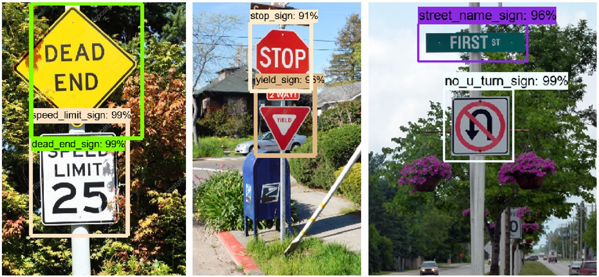

# Motivation
The motivation for this project lays both personal interest in a better understanding for object detection and academic research. The goal is to develop a foundation for a road-sign-detection (RSD) with the option to add further objects or functions to it. The ultimate goal is to have a useable object detection for the automotive sector.

# Table of Contents

0. Setup
    * <a href='https://github.com/tensorflow/models/blob/master/research/object_detection/g3doc/installation.md'>Tensorflow-gpu Installation</a> 
    * Find front images
    * Prepare front images

1. Generate Training Images and csv file 
2. Create TF records
3. Train 
4. Tensorboard
5. Export inference graph
6. run model on images in jupyter notebook
7. run model on webcam 

# 0. Setup
### Tensorflow-gpu Installation

### Find front images
I chose street signs, but it can be anything.

  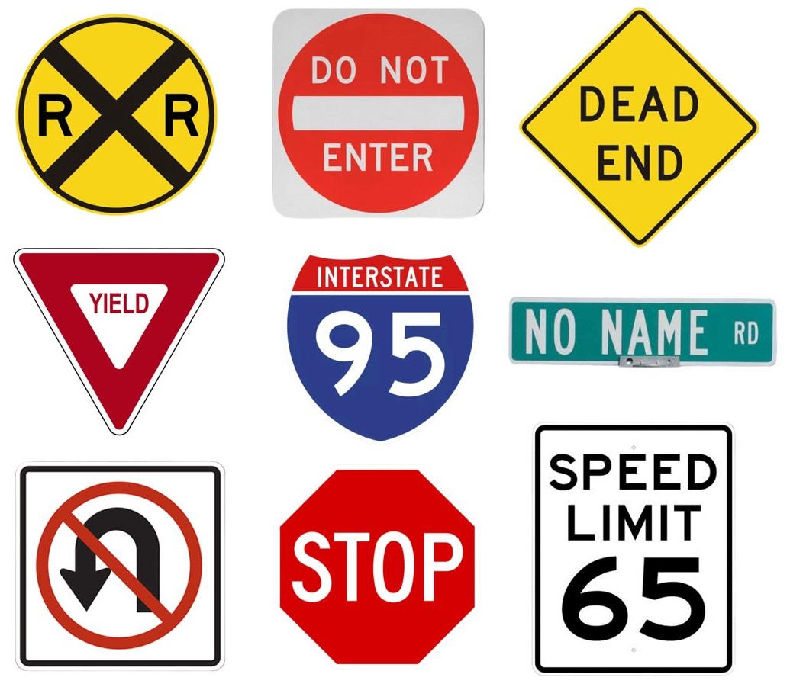

### Prepare front images
You must remove the background. I used: https://www.remove.bg

  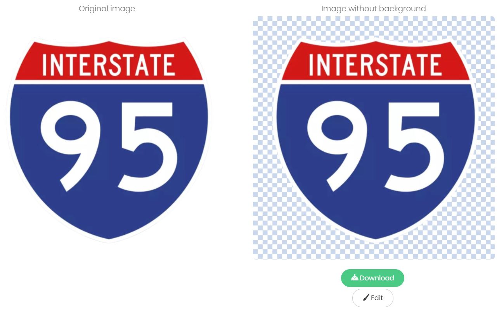

    

# 1. Generate Training Images and csv file 

The first step to take was to define the road signs and objects for the database. The database builds up on the RUB ["German Traffic Sign Database"][1], therefore the objects in the database used in the repository are similar pictures of everyday traffic situations in Germany. In order to build the database that would be able to detect a larger amount of road signs it was necessary to label a much larger number of pictures. The goal was to distinguish between more than 150 road signs, traffic lights and more than 15 physical objects such as pedestrians, cars and motorcycles.

### Analysing the Labels

As real-life traffic situations are used as input of the process the dataset needs to be reviewed and analysed regularly. Therefore, another tool was developed (DataSetCLI.py) to manage the large amounts of data. The tool offers multiple options for the database. All functions require a path to the root folder of your data, which should contain only images and xml-label files.

    .
    ├── root Data               #Root folder containing the data
        ├── images              #images location folder
        ├── labels              #xml location folder
        

### Generate Training Images

As not every class holds the same number of objects it becomes necessary to implement a data augmentation process. With this, existing pictures are alternated in such way that these can be used again in the learning process. For the augmentation the Python library "augmentor.py" [3] by the MIT is used. The tool has a large amount of functions implemented of which those useable for road sign detection are shown below. Some of these are only applayble to certain classes.

#### Rotate

Rotation is a simple function that allows to generate variance in the dataset. It needs to be ensured that the rotation is not to strong but somewhere between 10 and -10 degrees. Elsewise traffic signs may have a different meaning. This is also the reason why the rotate function of tensorflow can't be used as it only allows rotations at 90, 180 and 270 degrees.

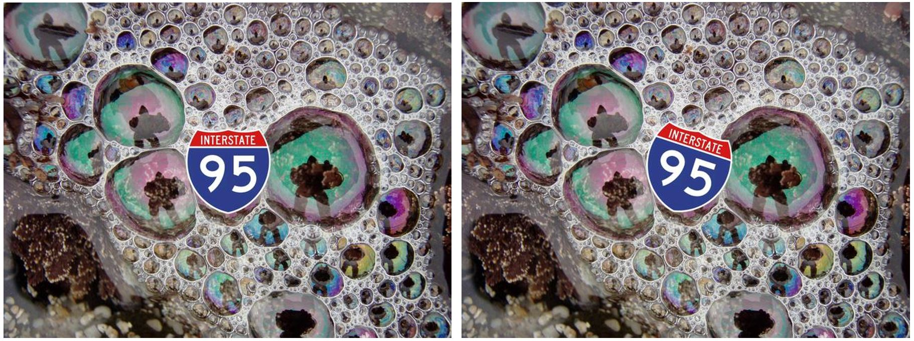

#### Brightness

Rotation is a simple function that allows to generate variance in the dataset. It needs to be ensured that the rotation is not to strong but somewhere between 10 and -10 degrees. Elsewise traffic signs may have a different meaning. This is also the reason why the rotate function of tensorflow can't be used as it only allows rotations at 90, 180 and 270 degrees.

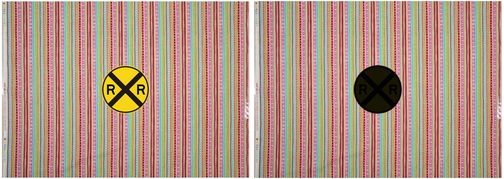

#### Relocate

The Zoom function is rather simple and lays focus on a different part of the picture. Yet the size of the image remains the same. The main advantage lays in a variance of quality and the relative strong change of objects in the overall image. 

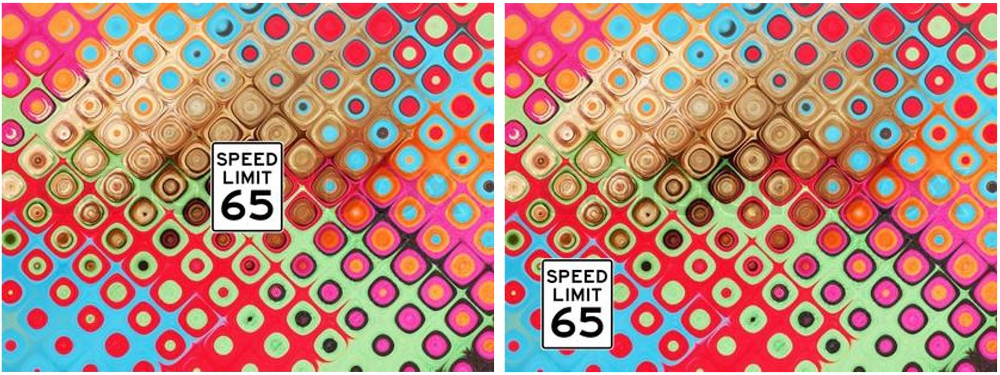

#### Stretch

Stretch is useable for many different directions. It includes horizontal and vertical shearing as well as shearing to each of the corners. The function augments the data in such way as it would result if another picture was taken seconds later. It also makes the trained model more robust towards different angles.

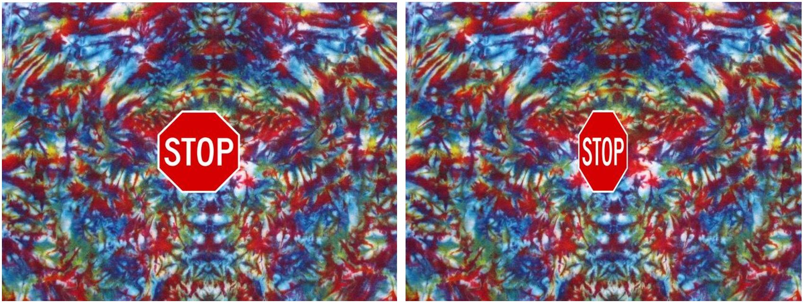

#### Resize

Elastic distortion is a very interesting alteration of the pictures. As it can be seen on the right picture the object's corners, such as the large direction sign, are warped. This happens usually while driving when the car hits potholes or experiences other sudden and strong movements. Due to the image generation line by line the image gets distorted.

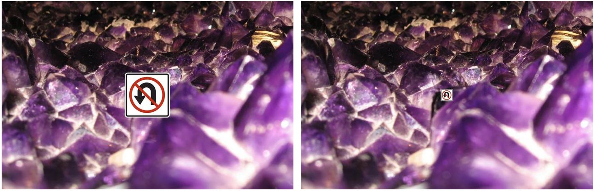

#### Contrast

The function is very simple as it just alters the contrast of the image. The idea behind this is again improving the robustness of the trained model. Different contrasts occur usually in different lightning situations and the image quality of the used camera.

#### Color

Elastic distortion is a very interesting alteration of the pictures. As it can be seen on the right picture the object's corners, such as the large direction sign, are warped. This happens usually while driving when the car hits potholes or experiences other sudden and strong movements. Due to the image generation line by line the image gets distorted.

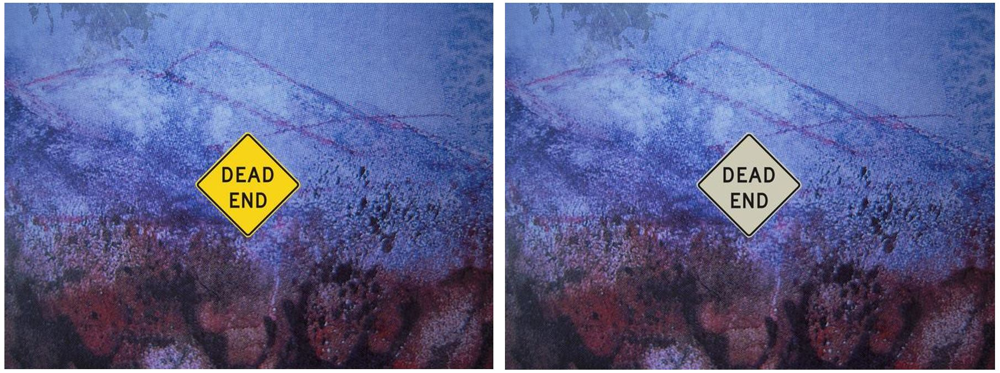

#### Results

Elastic distortion is a very interesting alteration of the pictures. As it can be seen on the right picture the object's corners, such as the large direction sign, are warped. This happens usually while driving when the car hits potholes or experiences other sudden and strong movements. Due to the image generation line by line the image gets distorted.

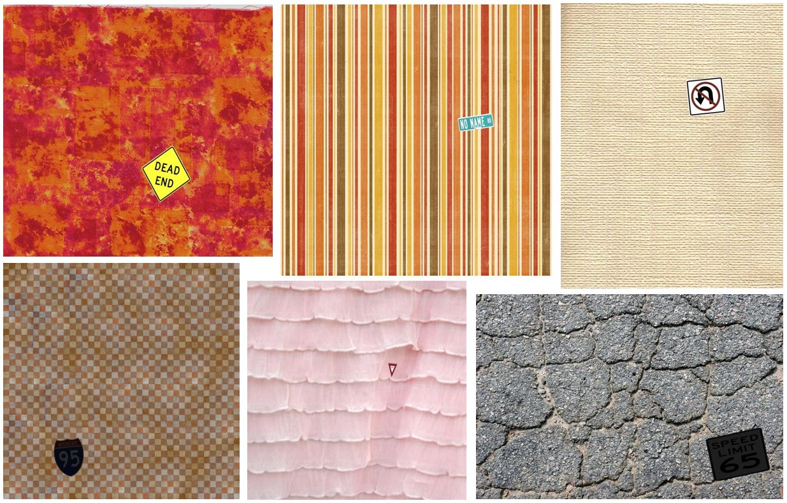

#### Generate csv file

With this a fairly large database was generated including 50.000 labels on approximately 35.000 images. As the objects, that were to be labelled, changed later on, the number of labels will keep growing rapidly. This will be done on the existing image database of 35.000 samples. An example of the database is presented below. 

  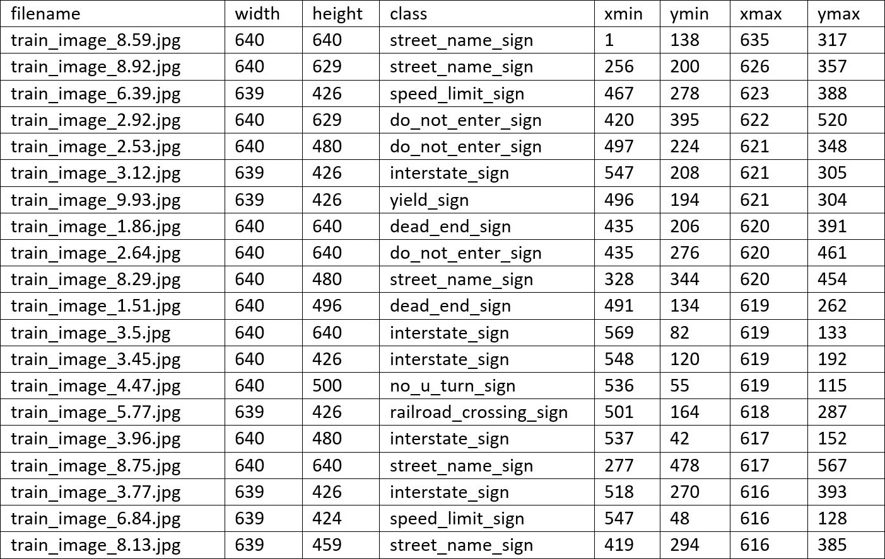

# 2. Generate TF records

For this, two neural networks were taken into account. "Faster_R-CNN_Inception_V2_COCO" and "SSD_Mobilenet_COCO" both neural networks are pretrained on the COCO dataset that includes thousands of pictures with labels from everyday situations, such as humans, cars, trees, airplanes, etc. (http://cocodataset.org/#home)[6]. Yet both differ strongly.

  

# 3. Train

With this a fairly large database was generated including 50.000 labels on approximately 35.000 images. As the objects, that were to be labelled, changed later on, the number of labels will keep growing rapidly. This will be done on the existing image database of 35.000 samples. An example of the database is presented below. 

  

# 4. Tensorboard

With this a fairly large database was generated including 50.000 labels on approximately 35.000 images. As the objects, that were to be labelled, changed later on, the number of labels will keep growing rapidly. This will be done on the existing image database of 35.000 samples. An example of the database is presented below. 

  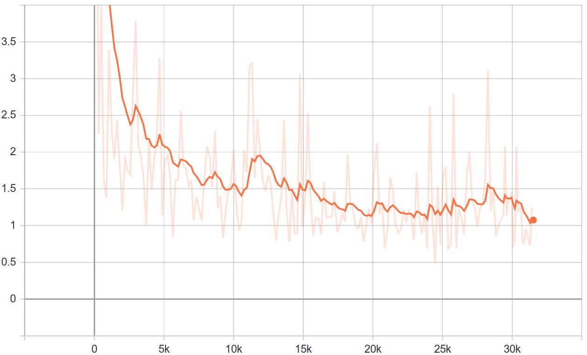

# 5. Export inference graph

With this a fairly large database was generated including 50.000 labels on approximately 35.000 images. As the objects, that were to be labelled, changed later on, the number of labels will keep growing rapidly. This will be done on the existing image database of 35.000 samples. An example of the database is presented below. 

  

## SSD_Mobilenet_COCO

SSD_Mobilenet is focused stronger on fast image detection. This means, that the results are less reliable, but it can be deployed on live feeds at 30fps and also has much lower hardware requirements. All in all, the findings were fairly weak especially with small amounts of data it was almost impossible to generate reliable output.

For SSD_Mobilenet the file dimensions are limited to 300x300 images. If changes are made to this in Tensorflow, the model doesn't detect anything, which can be very frustrating. Though it is possible to use the same workflow as described before. Various tools allow to cut out the pixel within the bounding boxes of the labels. With this the 300x300 image size is not as much of a restriction anymore. 

For this project the Faster-RCNN was chosen as the goal was develop a road-sign detection that reliably analyses a large amount of existing video data in order to improve the database that comes with it. Hence, the focus laid more on quality than on speed.

# 3. Using TensorFlow

For the object detection model Google's tensorflow was used running on 2 GeForce GTX 1080Ti with each 11GB of Vram. The processor is an Intel 8700K and 32GB of Ram. For the installation and set-up of the environment the tutorial by EdjeElectronics [4] was used. The tutorial gives a great introduction and makes it easy to set up the anaconda environment and tensorflow itself. Furthermore, it includes already all the necessary information on how to use your own dataset with TensorFlow. This includes generating the tf.record files, labelmap.pbtxt, ... 
For the training it is recommended to check the Tensorflow Model Zoo [5] on GitHub and apply the models to your own code. For this project Faster_RCNN_InceptionV2_COCO seemed to be the best fit. If everything was set up correctly the training is started by the following command in the anaconda prompt:

    python train.py --logtostderr --train_dir=training/ --pipeline_config_path=training/faster_rcnn_inception_v2_coco_A.config --num_clones=2 --ps_tasks=1
    
It should be emphasised that the last two commands `--num_clones=2 --ps_tasks=1` are necessary for the use with multiple GPUs. The "num_clones" states the number of GPUs in use. If only one GPU is used the command for the anaconda prompt is 

    python train.py --logtostderr --train_dir=training/ --pipeline_config_path=training/faster_rcnn_inception_v2_coco_A.config
    
The time to train depends strongly on the model. In this case the training times took approximately 10-12 days. In the chart it can be seen that after a strong decline in the beginning the loss maintained at a low level. The following image shows the training process of the road sign detection. 

All in all, three models were trained. One for road sign detection, one for object detection and a combination of those two. The result can be seen below. The first image shows the result of the road sign detection, while the second image shows the outcome of the object detection.  

# 4. Results

The results need to be distinguished in multiple ways. Such as accuracy and the kind of failures that occur. Over the entire model we reached an accuracy of about 85% of the road signs, with the camera close to the object. Which is well above the initial expectations for this research topic. The failures that occur in object-detection can be separated into tour different modes. Those will be described quickly, as a starting point for further readings into the subject.

#### True-Positive

The object detector correctly identifies an object. Hence, this is the result we are seeking for and no failure occured. In the case of this object detection this result became more reliable the closer the road sign was. 

#### False-Positive

A false positive detection appears when a sign is marked incorrectly. Incorrectly marked signs usually occur if those are too small, so for example in a large distance. The other main reason is an insufficient amount of labels, saved in the database. . This is especially important, as completely wrong detections can be hard to understand and to solve in many cases and sometimes even relate to issues within the label-database. Luckily this model doesn't suffer much from it. Usually high thresholds also ensure the limitation of true-negative detections. 

#### True-Negative

True negative detections are by definition not very spectacular, yet important. In this case the detector correctly doesn't give out any kind of result.

#### False-Negative

The opposite to true-negative are false-negative detections. In this case a sign or object is just missed by the detector. Also, often relating to low amounts of labels in the dataset. In this particular case we also see the limits of the faster-RCNN as shown in the picture below. While the "stop"-sign on the right and the "bus-stop"-sign are detected correctly, the "stop"-sign at the upper edge of the image is missed by the object detector. In this case the stop-sign is not at a common place but at a very usual space. The RCNN misses that due to its focus on common sizes and positions for the initial choice of regions to be analysed afterwards.

# 5. Outlook

The object-detection still needs further improvements in many cases. It is yet not accurate enough nor does the speed match our demands. As this was archived within a term-paper, it is still a strong start for further improvements. Those will include the database as well as tests with other neural networks such as YOLO. Furthermore, reinforced learning needs to be taken into account.

For further questions please refer to our LinkedIn profiles (that you can find in our profiles), contact us here on GitHub. We also appreciate if you leave a comment. 

# List of Refrences
[1]http://benchmark.ini.rub.de/?section=gtsdb&subsection=news
[2]https://github.com/tzutalin/labelImg
[3]https://augmentor.readthedocs.io
[4]https://github.com/EdjeElectronics/TensorFlow-Object-Detection-API-Tutorial-Train-Multiple-Objects-Windows-10/blob/master/README.md
[5]https://github.com/tensorflow/models/blob/master/research/object_detection/g3doc/detection_model_zoo.md
[6] http://cocodataset.org/#home
