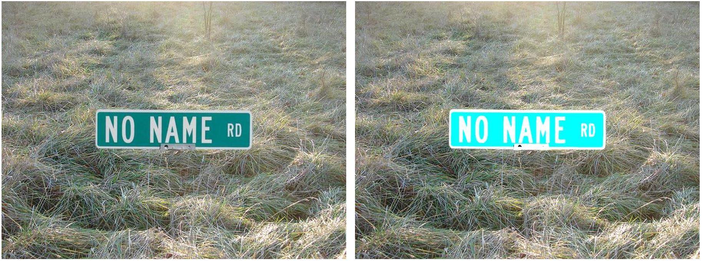

# Tensorflow object detection and artificial dataset generation
I reversed engineered the TensorFlow Object Detection API to make it easier to use, much simplier, and added voice. I created a artificial dataset generator which saves 100s of hours by avoiding having to find and label by hand, 1000s of images.

  

# Motivation
The motivation for this project lays both personal interest in a better understanding for object detection and academic research. The goal is to develop a foundation for a road-sign-detection (RSD) with the option to add further objects or functions to it. The ultimate goal is to have a useable object detection for the automotive sector.

# Table of Contents

0. Setup
    * <a href='https://github.com/tensorflow/models/blob/master/research/object_detection/g3doc/installation.md'>Tensorflow-gpu Installation</a> 
    * <a href='https://github.com/tensorflow/models/blob/master/research/object_detection/g3doc/detection_model_zoo.md'>Download a Model</a> 
    * <a href='https://github.com/tensorflow/models/tree/master/research/object_detection/samples/configs'>Download a Config File</a> 
    * Find Front Images
    * Prepare Front Images

1. Generate Training Images and csv file 
2. Create TF records
3. Train 
4. Tensorboard
5. Export inference graph
6. Run Model on Images in Jupyter Notebook
7. Run Model on Webcam 

# 0. Setup
### Tensorflow-gpu Installation
Install Tensorflow-gpu. Tutorial available <a href='https://github.com/tensorflow/models/blob/master/research/object_detection/g3doc/installation.md'>here</a>  or youtube tensorflow-gpu installation

### download a model 
download model from <a href='https://github.com/tensorflow/models/blob/master/research/object_detection/g3doc/detection_model_zoo.md'>here</a>  I used the ssd_mobilenet_v1_coco model.

    .
    ├── models                                # models folder containing the models
        ├── ssd_mobilenet_v1_coco model       # put the model folder here 

### download a config file 
download the config file that matches the model from <a href='https://github.com/tensorflow/models/tree/master/research/object_detection/samples/configs'>here</a> 
    
    .
    ├── training                                # training folder
        ├── ssd_mobilenet_v1_pets.config        # put the config file here
        ├── object-detection.pbtxt              

### Find front images
I chose street signs, but it can be anything.

  

### Prepare front images
You must remove the background. I used: https://www.remove.bg

  

    .
    ├── front                                # models folder containing the models
        ├── street_signs                     # put the front street sign images in here
        ├── new folder                       # or if its another class of object, put the images in here

# 1. Generate Training Images and csv file 

The first step to take was to define the road signs and objects for the database. The database builds up on the RUB ["German Traffic Sign Database"][1], therefore the objects in the database used in the repository are similar pictures of everyday traffic situations in Germany. In order to build the database that would be able to detect a larger amount of road signs it was necessary to label a much larger number of pictures. The goal was to distinguish between more than 150 road signs, traffic lights and more than 15 physical objects such as pedestrians, cars and motorcycles.

### Analysing the Labels

As real-life traffic situations are used as input of the process the dataset needs to be reviewed and analysed regularly. Therefore, another tool was developed (DataSetCLI.py) to manage the large amounts of data. The tool offers multiple options for the database. All functions require a path to the root folder of your data, which should contain only images and xml-label files.

    .
    ├── root Data               #Root folder containing the data
        ├── images              #images location folder
        ├── labels              #xml location folder
        

### Generate Training Images

As not every class holds the same number of objects it becomes necessary to implement a data augmentation process. With this, existing pictures are alternated in such way that these can be used again in the learning process. For the augmentation the Python library "augmentor.py" [3] by the MIT is used. The tool has a large amount of functions implemented of which those useable for road sign detection are shown below. Some of these are only applayble to certain classes.

#### Rotate

Rotation is a simple function that allows to generate variance in the dataset. It needs to be ensured that the rotation is not to strong but somewhere between 10 and -10 degrees. Elsewise traffic signs may have a different meaning. This is also the reason why the rotate function of tensorflow can't be used as it only allows rotations at 90, 180 and 270 degrees.

#### Brightness

Rotation is a simple function that allows to generate variance in the dataset. It needs to be ensured that the rotation is not to strong but somewhere between 10 and -10 degrees. Elsewise traffic signs may have a different meaning. This is also the reason why the rotate function of tensorflow can't be used as it only allows rotations at 90, 180 and 270 degrees.

#### Relocate

The Zoom function is rather simple and lays focus on a different part of the picture. Yet the size of the image remains the same. The main advantage lays in a variance of quality and the relative strong change of objects in the overall image. 

#### Stretch

Stretch is useable for many different directions. It includes horizontal and vertical shearing as well as shearing to each of the corners. The function augments the data in such way as it would result if another picture was taken seconds later. It also makes the trained model more robust towards different angles.

#### Resize

Elastic distortion is a very interesting alteration of the pictures. As it can be seen on the right picture the object's corners, such as the large direction sign, are warped. This happens usually while driving when the car hits potholes or experiences other sudden and strong movements. Due to the image generation line by line the image gets distorted.

#### Contrast

The function is very simple as it just alters the contrast of the image. The idea behind this is again improving the robustness of the trained model. Different contrasts occur usually in different lightning situations and the image quality of the used camera.

#### Color

Elastic distortion is a very interesting alteration of the pictures. As it can be seen on the right picture the object's corners, such as the large direction sign, are warped. This happens usually while driving when the car hits potholes or experiences other sudden and strong movements. Due to the image generation line by line the image gets distorted.

#### Results

Elastic distortion is a very interesting alteration of the pictures. As it can be seen on the right picture the object's corners, such as the large direction sign, are warped. This happens usually while driving when the car hits potholes or experiences other sudden and strong movements. Due to the image generation line by line the image gets distorted.

  

#### Generate csv file

With this a fairly large database was generated including 50.000 labels on approximately 35.000 images. As the objects, that were to be labelled, changed later on, the number of labels will keep growing rapidly. This will be done on the existing image database of 35.000 samples. An example of the database is presented below. 

  

# 2. Generate TF records

For this, two neural networks were taken into account. "Faster_R-CNN_Inception_V2_COCO" and "SSD_Mobilenet_COCO" both neural networks are pretrained on the COCO dataset that includes thousands of pictures with labels from everyday situations, such as humans, cars, trees, airplanes, etc. (http://cocodataset.org/#home)[6]. Yet both differ strongly.

  

# 3. Train

With this a fairly large database was generated including 50.000 labels on approximately 35.000 images. As the objects, that were to be labelled, changed later on, the number of labels will keep growing rapidly. This will be done on the existing image database of 35.000 samples. An example of the database is presented below. 

  

# 4. Tensorboard

With this a fairly large database was generated including 50.000 labels on approximately 35.000 images. As the objects, that were to be labelled, changed later on, the number of labels will keep growing rapidly. This will be done on the existing image database of 35.000 samples. An example of the database is presented below. 

  

# 5. Export inference graph

With this a fairly large database was generated including 50.000 labels on approximately 35.000 images. As the objects, that were to be labelled, changed later on, the number of labels will keep growing rapidly. This will be done on the existing image database of 35.000 samples. An example of the database is presented below. 

  

# 6. Run Model on Images in Jupyter Notebook

# 7. Run Model on Webcam

# Results

# Outlook

The object-detection still needs further improvements in many cases. It is yet not accurate enough nor does the speed match our demands. As this was archived within a term-paper, it is still a strong start for further improvements. Those will include the database as well as tests with other neural networks such as YOLO. Furthermore, reinforced learning needs to be taken into account.

For further questions please refer to our LinkedIn profiles (that you can find in our profiles), contact us here on GitHub. We also appreciate if you leave a comment. 

# List of Refrences
[1]http://benchmark.ini.rub.de/?section=gtsdb&subsection=news
[2]https://github.com/tzutalin/labelImg
[3]https://augmentor.readthedocs.io
[4]https://github.com/EdjeElectronics/TensorFlow-Object-Detection-API-Tutorial-Train-Multiple-Objects-Windows-10/blob/master/README.md
[5]https://github.com/tensorflow/models/blob/master/research/object_detection/g3doc/detection_model_zoo.md
[6] http://cocodataset.org/#home
